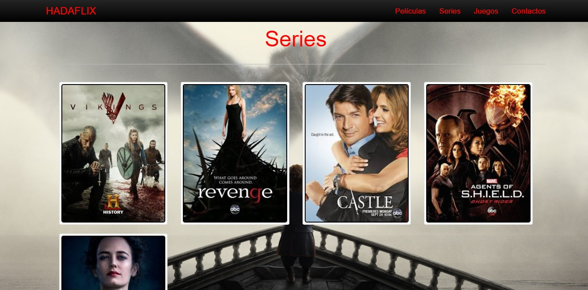

# Projecte HADA 2016-17

## Desenvolupadors del projecte:
- Álvaro Gironés Garcia (gg52@alu.ua.es)
- Javi Monllor Alcaraz (jma86@alu.ua.es)
- Juan Ruiz de Larrea Aracil (jrl12@alu.ua.es)
- Javier Rocamora Garcia (jrg81@alu.ua.es)
- David Berbegal Esteve (dbe4@alu.ua.es)

## Nom del projecte
# HadaFlix

## Descripció del projecte

## 1.	Descripció
  
> L’aplicació web que volem realitzar serà un videoclub, en el qual es podran llogar les diverses pel·lícules i series que es podran consultar a la pàgina principal. Per altra banda, també podem trobar una pel·lícula o serie mitjançant el filtrat de l’any de sortida, categoria a la que pertany, ...
  
> Amb la pel·lícula o serie ja elegida, i verificat que està disponible per a ser llogada, l’usuari podrà continuar llogant articles o finalitzar la seua operació.
  
> Respecte a la part privada d’un usuari, es podran visualitzar les seues pròpies dades, editar-les o donar de baixa el compte.
  
> En cas de ser un administrador del sistema, amb l’entrada a la part privada es podran afegir, editar i esborrar pel·lícules i series al sistema.

## 2.	Part Pública

> En la pàgina principal trobarem un llistat amb totes les pel·lícules i series que tenim disponibles per a poder ser llogades. 

> En aquesta pàgina es podran ordenar les pel·lícules i series segons els noms o filtrar mitjançant una determinada temàtica/categoria, l’any en que va sortir, ...

> També es podrà llogar una determinada pel·lícula o serie si es troba disponible. En cas de que estiga disponible i es vuiga llogar es tindrà que accedir a la pròpia pulsant sota el títol. Una vegada dins de la pàgina es podrà llegir una xicoteta sinopsi d’aquesta per tal de verificar si és allò que busquem. Es podrà trobar un botó que ens permetrà realitzar el llogament.

> Una vegada s’haja pulsat aquest botó es tindrà que viatjar al carret de llogament i confirmar allò que em triat.

> Seguidament s'adjunten alguns mockups de quina seria l'apariència estimada que obtindríem com a resultat:

## 3.	Llistat EN Pública

- Series
- Películes
- Clients
- Empleats
- Proveedors
- Venta
- Pedidos

## 4.	Part Privada

> En la part privada de l’aplicació es podran visualitzar les dades personals de l’usuari per tal de veure si són correctes o tenen algun tipus d’error. Amb aquesta acció, i si l’usuari ho considera necessari es podran editar les dades si alguna cosa no és correcta o el perfil es troba incomplet. També es podrà esborrar el compte si es pensa que ja no es necessari tenir-lo.

> En cas de tractar-se de la part privada d’un administrador es podran afegir noves pel·lícules o series al llistat que ja tenim, juntament amb la foto de portada. Al igual que també es podrà realitzar l’eina de modificar-lasi conté en el seu títol, descripció o portada algun camp incorrecte; o esborrar-lai ja no es disposa d’aquesta.

> També es podrà veure un llistat de totes les pel·lícules i series que s’han llogat des de que es va crear un usuari el compte a la pàgina.

## 5.	Llistat EN Privada

- Series
- Películes
- Clients
- Empleats
- Proveedors
- Venta
- ListaVentas
- Pedidos

## 6.	Possibles millores

> La possibilitat d’afegir a la pàgina el llogament de videojocs, al igual que un apartat de merchandising de les diverses pel·lícules i series de les quals es disposen a la base de dades.
D'altra banda, també seria interessant la possibilitat de poder seleccionar el idioma en el qual es poden visualitzar els continguts de les pel·lícules/series (La sinopsi).
