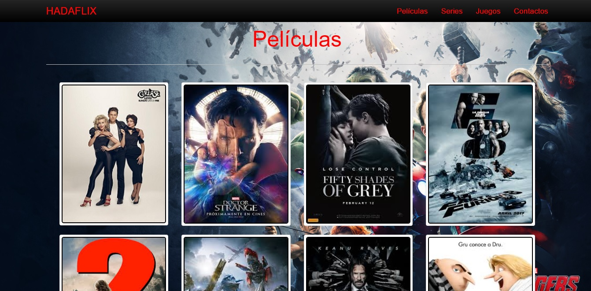

# HadaFlix

## Desenvolupadors del projecte:
- Álvaro Gironés Garcia (gg52@alu.ua.es)
- Javi Monllor Alcaraz (jma86@alu.ua.es)
- Juan Ruiz de Larrea Aracil (jrl12@alu.ua.es)
- Javier Rocamora Garcia (jrg81@alu.ua.es)
- David Berbegal Esteve (dbe4@alu.ua.es)

# Esquema EERR Base de Dades
## Ubicació: /Esquema Base de Dades/EERR BBDD.png

# 1. Proposta de projecte
## Descripció del projecte

## 1.1.	Descripció
  
> L’aplicació web que volem realitzar serà un videoclub, en el qual es podran llogar les diverses pel·lícules i series que es podran consultar a la pàgina principal. Per altra banda, també podem trobar una pel·lícula o serie mitjançant el filtrat de l’any de sortida, categoria a la que pertany, ...
  
> Amb la pel·lícula o serie ja elegida, i verificat que està disponible per a ser llogada, l’usuari podrà continuar llogant articles o finalitzar la seua operació.
  
> Respecte a la part privada d’un usuari, es podran visualitzar les seues pròpies dades, editar-les o donar de baixa el compte.
  
> En cas de ser un administrador del sistema, amb l’entrada a la part privada es podran afegir, editar i esborrar pel·lícules i series al sistema.

## 1.2.	Part Pública

> En la pàgina principal trobarem un llistat amb totes les pel·lícules i series que tenim disponibles per a poder ser llogades. 

> En aquesta pàgina es podran ordenar les pel·lícules i series segons els noms o filtrar mitjançant una determinada temàtica/categoria, l’any en que va sortir, ...

> També es podrà llogar una determinada pel·lícula o serie si es troba disponible. En cas de que estiga disponible i es vuiga llogar es tindrà que accedir a la pròpia pulsant sota el títol. Una vegada dins de la pàgina es podrà llegir una xicoteta sinopsi d’aquesta per tal de verificar si és allò que busquem. Es podrà trobar un botó que ens permetrà realitzar el llogament.

> Una vegada s’haja pulsat aquest botó es tindrà que viatjar al carret de llogament i confirmar allò que em triat.

> Seguidament s'adjunten alguns mockups de quina seria l'apariència estimada que obtindríem com a resultat:

## 1.3.	Llistat EN Pública

- Series
- Películes
- Clients
- Empleats
- Proveedors
- Venta
- Pedidos

## 1.4.	Part Privada

> En la part privada de l’aplicació es podran visualitzar les dades personals de l’usuari per tal de veure si són correctes o tenen algun tipus d’error. Amb aquesta acció, i si l’usuari ho considera necessari es podran editar les dades si alguna cosa no és correcta o el perfil es troba incomplet. També es podrà esborrar el compte si es pensa que ja no es necessari tenir-lo.

> En cas de tractar-se de la part privada d’un administrador es podran afegir noves pel·lícules o series al llistat que ja tenim, juntament amb la foto de portada. Al igual que també es podrà realitzar l’eina de modificar-lasi conté en el seu títol, descripció o portada algun camp incorrecte; o esborrar-lai ja no es disposa d’aquesta.

> També es podrà veure un llistat de totes les pel·lícules i series que s’han llogat des de que es va crear un usuari el compte a la pàgina.

## 1.5.	Llistat EN Privada

- Series
- Películes
- Clients
- Empleats
- Proveedors
- Venta
- ListaVentas
- Pedidos

## 1.6.	Possibles millores

> La possibilitat d’afegir a la pàgina el llogament de videojocs, al igual que un apartat de merchandising de les diverses pel·lícules i series de les quals es disposen a la base de dades.
D'altra banda, també seria interessant la possibilitat de poder seleccionar el idioma en el qual es poden visualitzar els continguts de les pel·lícules/series (La sinopsi).

# 2. Documentació del projecte

## 2.1. Canvis:
Respecte a la proposta de projecte que es va realitzar primerament s’han realitzat diversos canvis que han canviat el resultat final de l’aplicació. Els canvis realitzats són:
o	S’ha afegit un mapa on es pot comprovar la localització física del videoclub.
o	En cas de que un usuari es registre en l’aplicació i oblide la seua contrasenya, amb la inserció del seu correu en la pantalla de “recordar contrasenya”, s’enviarà la contrasenya del correu insertat al correu corresponent.
o	També s’ha afegit un nou tipus d’article al videoclub, els jocs. Un usuari podrà realitzar les mateixes accions que realitzava sobre pel·lícules i sèries, ara també sobre jocs.

## 2.2. Dificultats:

## 2.3. Problemes:
El principal problema en el qual ens em trobat a l’hora de realitzar el projecte a sigut l’enfocament erroni del conjunt final. 
Primerament es va pensar en la realització d’una aplicació que poguera ajudar a la organització i un correcte funcionament d’un videoclub. Dins de la pròpia aplicació; el gestor del videoclub, o l’empleat, podien donar de alta llogues que fera un client d’un determinat article, donar d’alta un proveïdor, una pel·lícula, … 
El canvis que acabem de comentar han provocat la creació d’una tenda online on un determinat usuari pot registrar-se per tal de realitzar un lloguer d’una pel·lícula, una sèrie, un joc, ...
Per altra part cal destacar que el paper del proveïdor de productes ha perdut el seu protagonisme degut a que una persona no està controlant la pàgina per tal de guardar totes aquestes dades.

## 2.4. Planificació: 
### 2.4.1. Guia d’ús de l’aplicació:

### 2.4.2. Usuari i contrasenya:
Després del problema de una mala planificació del producte final, l’aplicació s’ha quedat privada d’una part d’administració on es pugui poder afegir els diferents articles dels quals disposa el videoclub.
Per tal de poder afegir informació es realitzen les insercions en la base de dades directament.

### 2.5. Tasques:
#### 2.5.1. Planificació Inicial:

| Nom	         		|Tasca								|
| :------------------------: 	| :------------------------------------------------------------------------: 	|
| Álvaro Gironés     	|
| Javier Monllor      	|
| Javier Rocamora  	|
| Juan Ruíz 	        	|
| David Berbegal    	|

#### 2.5.2. Planificació Final:

|Nom	         		|Tasca  	       						|
| :------------------------: 	| :------------------------------------------------------------------------:	|
| Álvaro Gironés      	| Proposta de Projecte					|
|			| CADClient:        						|
|		         	| ENClient:            						|
|			| Test de Client						|
|                                 	| CADProveedor: 						|
|                                   	| ENProveedor:    						|
|			| Test de Proveïdor						|
|			| Memòria del projecte					|
|			| Presentació del projecte					|
| Javier Monllor      	| Proposta de Projecte					|
|			| BBDD               						|
|		        	| Creació Projecte Base 					|
|			| Memòria del projecte					|
|			| Presentació del projecte					|
| Javier Rocamora  	| Proposta de Projecte					|
|			| CADAdquisició						|
|		        	| ENAdquisició						|
|			| Test de Adquisició						|
|		        	| CADLineaAdquisició						|
|                                 	| ENLineaAdquisició						|
|			| Test de Línia d’Adquisició					|
|			| Memòria del projecte					|
|			| Presentació del projecte					|
| Juan Ruíz 	        	|Proposta de Projecte					|
|			| CADProducte: Creació, edició i eliminació de productes	|
|		        	| EN Producte:						|
|			| Test de Producte						|
|		        	| CADEmpleat:						|
|			| EN Empleat:							|
|			| Test d’Empleat						|
|			| Memòria del projecte					|
|			| Presentació del projecte					|
| David Berbegal    	| Proposta de Projecte					|
|			| Proposta de Projecte (Documentació)			|
|			| CADVenta: 							|
|			| ENVenta:							|
|			| Test de Venta						|
|			| CADAlquiler:							|
|			| ENAlquiler:							|
|			| Test d’Alquil·ler						|
|			| Memòria del projecte					|
|			| Memòria del projecte (Documentació)			|
|			| Presentació del projecte					|
|			| Presentació del projecte (Documentació)			|
|			| Gestió del GitHub						|

# 3. Presentació del projecte: 
## Ubicació: /Presentacio/Presentacio.pdf
